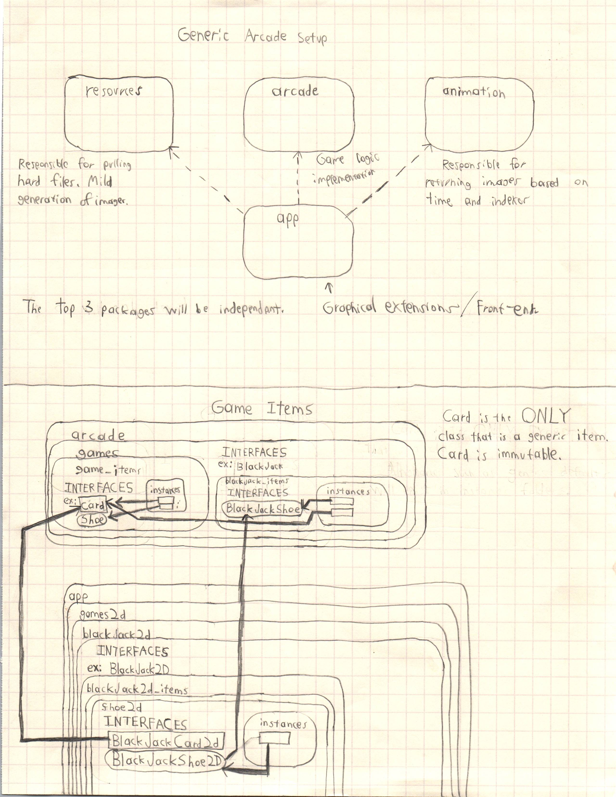

# ARCADE
Will have several fun games that supports several different currencies and credits.
Current Priorities:
BlackJack

## Purpose
The initial purpose of this class is to rebuild the BlackJack game using good OOP practices and SOLID principles.
The classes will be extensible to several other Casino/Arcade games.

Most games will have an Expected Value (EV) calculator that can generate how much currency you will win or lose over time.
Some systems will be much harder to implement than others.

As the focus is BlackJack for now, the program will simulate millions of hands and generate Basic Strategy tables using various counting system techniques.

## Update
This next update will focus on the completion of TableCycle. The purpose of TableCycle is to ensure all mechanical functionality will work before BlackJack is released.

ShoeCycle brings up a concern of adding and removing IAppItems and GameItems. Need to modify some add and remove commands to handle IAppItem components and Non-IAppItem components safely. Right now there is not an easy way to add and remove these items.

### Single Responsibility Principle Violation
1. BlackJackTable interface has 2 responsibilities:
* Transfer cards to and from Shoe, Table and Players,
* Transfers currencies to and from Table and Players

## Next Master Push Goals
- [x] Draw the Shoe Image itself onto the ShoeCycle.
	- [x] Need to refactor the Shoe2D to implement GameItem instead of IAppItem (Reminder: GameItem extends IAppItem).
- [ ] Develop the TableCycle (Except money transactions).
	- [ ] Create a "Builder class" for BlackJackTables.
		NOTE: Too many parameters for the combination of tables so a Builder is needed for simplicity.
	- [ ] Generic Type Parameters
		- [ ] Currency Type ("This" table will only take one type of currency)
		- [ ] BlackJackCard Type
	- [ ] The TableCycle will allow you to Create a Player by Swapping out field and allowing a create user with an add or user.
- [ ] Need to figure out a good way to properly package and structure players. (Players need to "sit" in seats and also need to be able to "leave/get up" from seats.

## Future improvements
Upon Successful completion of arcade library:
will convert project into a maven build to prepare CI testing.

The Swing application will remain public and effectively an example of how to utilize.
Servlets will be a secure private repository utilizing public "arcade" library.

Will be using Apache Tomcat 10.1.1 Web Container. Not yet deployed.
Digital Ocean: 198.199.71.169

## High level structure.

The "arcade" package will be treated as a library (will be reusable in different projects).
The "animation" package will be treated as a library (will be reusable in different projects).
The "app" package will utilize the arcade and animation libraries as necessary.
The "debug" package will be destoryed in the future so good practices will not be focused. This will only exist until Test Case library OR separate implementation exists.
